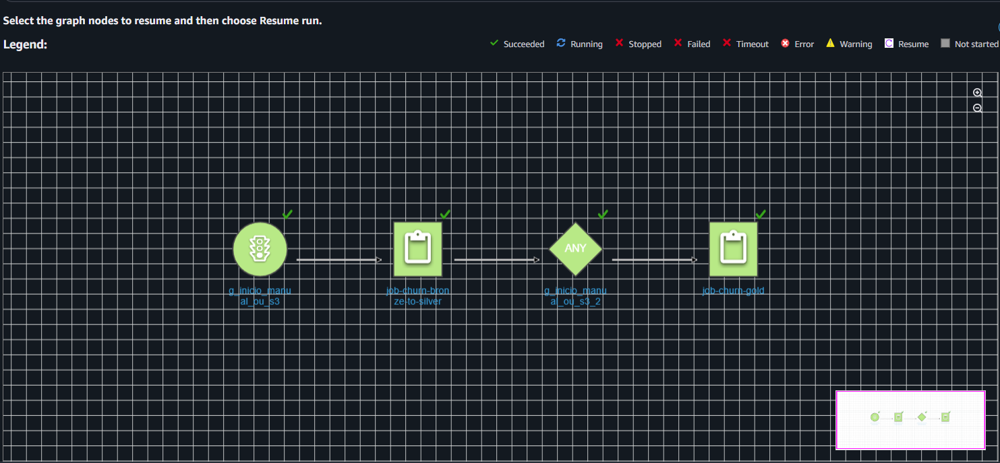

## AWS Data Pipeline: Churn Analytics (Medallion Architecture)

## ⚠️  NOTA DE ORIGEM DOS DADOS 

**Importante:** O dataset original utilizado neste projeto foi extraído do site "Kaggle" e pode ser acessado através deste **link** https://www.kaggle.com/code/emineyetm/telco-customer-churn/input

Qualquer semelhança com nomes, pessoas ou dados da vida real é mera coincidência. Este ambiente foi construído estritamente para fins de demonstração técnica e estudo de engenharia de dados.

## Visão Geral
Este projeto implementa um pipeline de dados automatizado na **AWS** para analisar a taxa de cancelamento (Churn) de uma empresa de telecomunicações. Utilizamos a **Arquitetura Medalhão** (Bronze, Silver e Gold) para organizar os dados desde o estado bruto até o consumo analítico.

## Arquitetura do Data Lake (S3)

O fluxo segue a lógica de transformação progressiva:

## Orquestração (AWS Glue Workflows)
O projeto utiliza AWS Glue Workflows. O processamento da camada Gold só inicia após o sucesso da Silver, garantindo que os insights de negócio nunca sejam baseados em dados desatualizados ou corrompidos.
 
*Status: Succeeded (Full Green)*

## Detalhes das Camadas (ETL)

Data Cleaning: Remoção de duplicatas por customerID e filtragem de nulos em colunas críticas.

Tipagem Corrigida: Recálculo da coluna TotalCharges (renomeada para TotalCharges_Pipeline) para corrigir inconsistências de tipo do arquivo original.

Feature Engineering: Criação da métrica Qtd_Servicos (soma horizontal de serviços ativos por cliente).

Otimização: Conversão de CSV para Parquet com particionamento, reduzindo custos de leitura.

Nesta etapa, os dados são agregados em tabelas temáticas para responder perguntas de negócio:

Análise de Fidelidade: Impacto do tipo de contrato no Churn.

Análise de Infra: Relação entre o tipo de Internet (Fibra vs DSL) e cancelamentos.

Perfil VIP: Comportamento de clientes com dependentes e parceiros.

## Tecnologias Utilizadas

* **Linguagem & Processamento:** Python (PySpark) para ETL e limpeza
* **Armazenamento (Data Lake):** Amazon S3 (Estrutura Bronze/Silver/Gold)
* **Governança & Catálogo:** AWS Glue Crawler (Mapeamento automático de Schema)
* **Orquestração:** AWS Glue Workflows para automação do pipeline

## 📈 Insights e Dashboards
Os insights e dashboards estão documentados neste repositório:  
[🔗 Projeto Churn Insights](https://github.com/Mattustk/Projeto-Churn-Insights)
